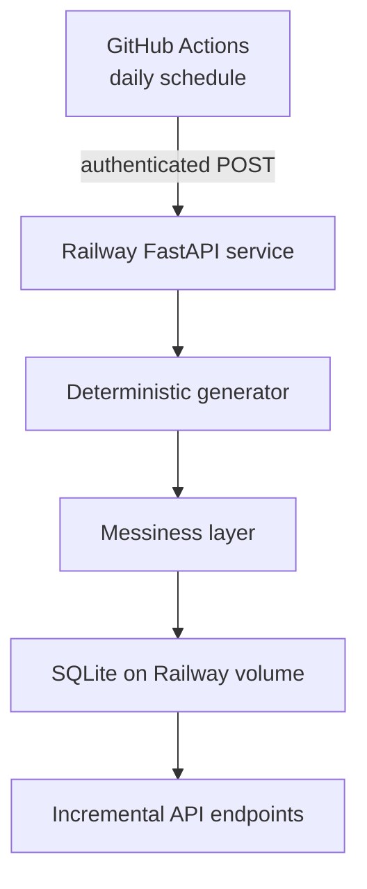

# Guitar Lessons Marketing Data API

This repository hosts the synthetic source system for the guitar-lessons
marketing analytics project. It generates a coherent business history, adds
controlled source-data defects, stores each raw delivery in SQLite, and serves
incremental JSON through FastAPI.

The API is designed for a Railway web service. A GitHub Actions cron workflow
calls a protected endpoint each day, and the web service writes the new data to
its SQLite database on a Railway persistent volume.

## How the pieces fit together



The web service is the only process that writes the SQLite file. The scheduled
workflow triggers generation over HTTPS, so the cron process does not need
direct filesystem access to the Railway volume.

## Repository structure

```text
.
├── app/
│   ├── main.py                 # FastAPI routes and protected generation endpoint
│   ├── settings.py             # Environment and Railway volume configuration
│   ├── db.py                   # SQLite schema, connections, and API reads
│   └── generation_service.py   # Snapshot comparison and idempotent delivery logic
├── generator/
│   ├── config.py
│   ├── historical_seed.py
│   ├── daily_generator.py
│   ├── messiness.py
│   └── validation.py
├── scripts/
│   ├── initialize_db.py        # Seed history and catch up through today
│   └── generate_daily.py       # Run one local idempotent generation
├── tests/
├── .github/workflows/
│   ├── daily-generation.yml
│   └── tests.yml
├── Dockerfile
├── railway.json
├── requirements.txt
└── requirements-dev.txt
```

The supplied `database_loader.py` targets PostgreSQL staging and analytics
schemas. It belongs in the downstream analytics-pipeline repository, so this
API uses the new SQLite storage layer in `app/db.py` instead.

## Data model inside SQLite

SQLite contains four internal tables:

| Table | Purpose |
|---|---|
| `raw_deliveries` | Append-only messy source rows returned by the API |
| `source_state` | Hash of the latest clean version of each business key |
| `generation_runs` | Audit record for each completed generation date |
| `metadata` | Current generator state, including `last_generated_date` |

The generator rebuilds the deterministic clean simulation through the target
date and compares it with `source_state`. New or changed business records pass
through the messiness layer and are appended to `raw_deliveries`. SQLite assigns
each delivery a permanent, increasing `_raw_row_id`.

This handles records that legitimately change later, such as an open
subscription period that eventually receives an end timestamp. It also makes
the daily operation idempotent: repeating the same target date adds zero rows.

## API endpoints

| Method | Path | Purpose |
|---|---|---|
| `GET` | `/health` | Confirm that the API and SQLite database are available |
| `GET` | `/tables` | List the seven source tables and their delivery counts |
| `GET` | `/tables/{table_name}/raw` | Read raw rows incrementally |
| `GET` | `/status` | Inspect the latest generation and per-table cursors |
| `POST` | `/api/admin/generate` | Generate through today; requires a bearer token |

### Incremental extraction

Start with:

```text
GET /tables/fact_payment/raw?since=0&limit=1000
```

The response includes:

```json
{
  "table_name": "fact_payment",
  "since": 0,
  "next_since": 1842,
  "has_more": true,
  "count": 1000,
  "data": []
}
```

Save `next_since` as the table's watermark and request the next page. Continue
until `has_more` is `false`. The `_raw_row_id` values are global SQLite IDs, so
gaps within one table's sequence are normal.

Interactive OpenAPI documentation is available at `/docs`.

## Run locally

Create an environment and install the development dependencies:

```bash
python -m venv .venv
source .venv/bin/activate
pip install -r requirements-dev.txt
```

Create a local `.env` from `.env.example`, or export a token directly:

```bash
export DAILY_GENERATION_TOKEN="replace-with-a-long-random-value"
```

Initialize the database and run the API:

```bash
python -m scripts.initialize_db
uvicorn app.main:app --reload
```

Then open `http://localhost:8000/docs`.

Run the tests with:

```bash
pytest -q
```

## Deploy the web service to Railway

1. Push this repository to GitHub.
2. Create a Railway project and deploy the repository as a service.
3. Attach a persistent volume to the web service at `/data`.
4. Add a long random `DAILY_GENERATION_TOKEN` variable to the service.
5. Keep `AUTO_BACKFILL_ON_STARTUP=true`.
6. Generate a Railway public domain and confirm that `/health` returns a
   successful response.

When Railway attaches the volume, it provides `RAILWAY_VOLUME_MOUNT_PATH`.
`app/settings.py` stores the database at
`<RAILWAY_VOLUME_MOUNT_PATH>/marketing_data.db`. Local runs use
`data/marketing_data.db` unless `SQLITE_PATH` is set.

If Railway environment variables are present but no volume mount is available,
the application stops with a clear configuration error. This prevents a
seemingly successful deployment from writing history to an ephemeral database
that disappears on the next redeploy.

The Dockerfile intentionally starts one Uvicorn worker. SQLite writes are
serialized inside the application, and a Railway volume-backed service should
also remain at one replica.

Railway references:

- [Volumes](https://docs.railway.com/volumes)
- [Railway variable reference](https://docs.railway.com/variables/reference)
- [Dockerfiles](https://docs.railway.com/builds/dockerfiles)

## Configure the daily cron workflow

In the GitHub repository, create these Actions secrets:

| Secret | Example |
|---|---|
| `API_BASE_URL` | `https://your-service.up.railway.app` |
| `DAILY_GENERATION_TOKEN` | The same token stored in Railway |

The workflow in `.github/workflows/daily-generation.yml` runs at 06:17 UTC and
can also be started manually from the Actions tab. It sends:

```text
POST /api/admin/generate
Authorization: Bearer <token>
```

The non-round minute reduces the chance of GitHub's busiest scheduling period.
GitHub notes that scheduled workflows can still be delayed or occasionally
dropped, and scheduled workflows in inactive public repositories can be
disabled. The API therefore checks the full deterministic history at startup
and catches up through the current UTC date.

## Environment variables

| Variable | Required | Default | Purpose |
|---|---:|---|---|
| `DAILY_GENERATION_TOKEN` | Railway: yes | — | Protect the generation endpoint |
| `AUTO_BACKFILL_ON_STARTUP` | No | `true` | Seed and catch up when the service starts |
| `API_DEFAULT_PAGE_SIZE` | No | `1000` | Default number of raw rows per response |
| `API_MAX_PAGE_SIZE` | No | `10000` | Maximum allowed response page |
| `SQLITE_PATH` | No | Railway volume or local `data/` | Override the SQLite path |

## Operational checks

After deployment, verify:

1. `/health` shows `status: healthy` and a populated
   `last_generated_date`.
2. `/tables` lists all seven source tables.
3. Repeating an authenticated generation request for the same date returns
   `status: already_current` and adds zero rows.
4. A new generation date increases at least some table cursors.
5. Redeploying the Railway service preserves the existing row counts.

## Versioned campaign-daily replay

`CAMPAIGN_DAILY_STATE_HASH_VERSION` is included only in the internal state
hash for `fact_campaign_daily`. Changing this version causes the next
successful new-date generation to append one corrected delivery of the
complete deterministic campaign-daily history.

The original raw deliveries remain available as an audit trail. After the
replay, the stored hashes use the new version and normal incremental behavior
resumes. Downstream consumers must ingest the newly appended cursor range and
apply their documented latest-record cleaning logic.
